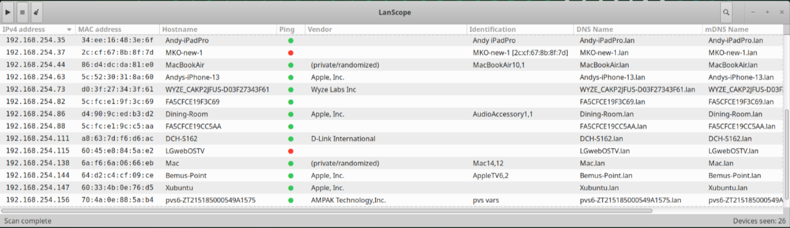

# LanScope

A LanScan-style LAN scanner for Linux — GTK3 frontend, small privileged
helper for ARP discovery. Built for Xubuntu/XFCE but nothing here is
XFCE-specific; it should run on any GTK3 desktop (Ubuntu/GNOME, Mint/Cinnamon,
Debian, etc).


## Features

- **Live streaming discovery** — rows appear the instant an ARP reply
  arrives, not after the whole sweep finishes.
- **Privilege separation** — only a small (~180 line), dependency-free
  helper runs as root, launched via polkit/pkexec. The GUI itself is
  never privileged.
- **Graceful fallback** — if pkexec is declined or unavailable, falls back
  to an unprivileged ping sweep + kernel neighbour-table harvest.
- **Rich per-host enrichment**, all unprivileged:

  | Column          | Source                                            |
  |-----------------|----------------------------------------------------|
  | IPv4 / MAC      | ARP replies (helper) or neighbour table (fallback) |
  | Vendor          | IEEE OUI database (arp-scan/ieee-data/nmap)        |
  | Ping            | green/red/gray status dot                          |
  | DNS Name        | reverse DNS (your router's `.lan` PTR records)      |
  | mDNS Name       | `avahi-resolve-address`                            |
  | Identification  | `avahi-browse`, prefers `model=` TXT record        |
  | SMB Name/Domain | `nmblookup -A`                                     |

- **Sortable, filterable table** — click any column header to sort
  (IP sorts numerically, not lexically); Ctrl+F for a live filter across
  all columns.
- **Copy/paste support** — right-click any row for "Copy IP address",
  "Copy MAC address", or "Copy row" (tab-separated, pastes into a
  spreadsheet); Ctrl+C copies the selected row's IP.
- **Readable table** — alternating row shading and column padding.
- Randomized/private MACs (common on phones) are labeled
  `(private/randomized)` in Vendor rather than left blank.

## Screenshot



## Architecture

```
┌────────────────────────────┐        pkexec         ┌───────────────────────┐
│ lanscope.py (GTK3, user)   │ ────────────────────▶ │ lanscope-helper (root)│
│  · sortable device table   │  ◀── JSON lines ────  │  · raw ARP sweep      │
│  · filter bar (Ctrl+F)     │      (streaming)      │  · stdlib only        │
│  engine.py (user)          │                       │  · ~180 lines         │
│  · ping / rDNS / avahi     │                       └───────────────────────┘
│  · nmblookup / OUI vendor  │
└────────────────────────────┘
```

Only the helper runs as root. It takes no untrusted input beyond an
optional interface name and timeout, has no third-party imports, and only
*emits* data (JSON lines on stdout) — it never reads GUI input directly.
Everything else — ping, reverse DNS, mDNS, NetBIOS, OUI vendor lookup —
runs unprivileged in the GTK process.

## Requirements

- Python 3.8+
- GTK3 + PyGObject (`python3-gi`, `gir1.2-gtk-3.0`)
- polkit (ships by default on Ubuntu/Xubuntu desktop installs)
- Optional but recommended, for full column coverage:
  - `arp-scan` or `ieee-data` — IEEE OUI vendor database
  - `avahi-utils` — mDNS Name + Identification columns
  - `samba-common-bin` — SMB Name/Domain columns (provides `nmblookup`)

## Install

### Ubuntu / Xubuntu / Debian-based (recommended)

```bash
git clone https://github.com/<your-username>/lanscope.git
cd lanscope
chmod +x install-lanscope.sh lanscope-helper

sudo apt install python3-gi gir1.2-gtk-3.0 arp-scan avahi-utils samba-common-bin
sudo ./install-lanscope.sh
lanscope
```

`install-lanscope.sh`:
- installs the app to `/opt/lanscope`
- installs the privileged helper to `/usr/local/libexec/lanscope-helper`
- installs the polkit policy to `/usr/share/polkit-1/actions/`
- adds a `lanscope` launcher to `/usr/local/bin`
- adds a desktop entry (find it under **Network** in your app menu)
- is idempotent — safe to re-run after `git pull` to pick up updates
- also cleans up any install of the project's previous name (`netscan`),
  if you're upgrading from an early version

### Other GTK3 Linux distros (Fedora, Arch, openSUSE, etc.)

The installer is Debian/Ubuntu-flavored (uses `apt` only for the dependency
line, which you can swap for your package manager). Package name
equivalents:

| Ubuntu/Debian       | Fedora            | Arch            |
|---------------------|-------------------|-----------------|
| python3-gi          | python3-gobject   | python-gobject  |
| gir1.2-gtk-3.0       | gtk3              | gtk3            |
| arp-scan            | arp-scan          | arp-scan        |
| avahi-utils         | avahi-tools       | avahi           |
| samba-common-bin    | samba-common-tools| samba           |

Then run `sudo ./install-lanscope.sh` as above — the script itself has no
distro-specific package-manager calls, only file installs.

### Run without installing (quick test, no root needed to try the UI)

```bash
python3 lanscope.py
```

Works immediately for the GTK UI. ARP scanning will prompt via pkexec if
the helper is already installed system-wide; if not, it degrades
automatically to the unprivileged ping-sweep fallback.

## Uninstall

```bash
sudo rm -rf /opt/lanscope \
            /usr/local/libexec/lanscope-helper \
            /usr/share/polkit-1/actions/io.github.lanscope.policy \
            /usr/local/bin/lanscope \
            /usr/share/applications/lanscope.desktop
```

## Security notes

- Only `lanscope-helper` runs as root; it is stdlib-only, takes minimal
  input, and never executes anything derived from network responses.
- The polkit policy's `exec.path` annotation pins pkexec to the installed
  helper path specifically — nothing else can piggyback on that
  authorization.
- Default policy is `auth_admin_keep`: any user can trigger a scan, but
  must authenticate as an admin, cached briefly so repeat scans don't
  re-prompt. Edit `io.github.lanscope.policy` before installing if you
  want different behavior (`auth_self_keep` to let any user authenticate
  as themselves; `yes` for no prompt at all on trusted single-user boxes).

## Known limitations / roadmap

- No infinite/continuous scan mode yet.
- No TCP port scan, per-column show/hide, or inline hostname editing.
- IPv6 is not scanned.
- Identification relies on a single `avahi-browse` pass per scan; a live
  `python-zeroconf` listener would substantially improve coverage.
- ARP sweep caps at /20 (4096 addresses) per scan.

Contributions and issues welcome.

## License

MIT — see [LICENSE](LICENSE).
